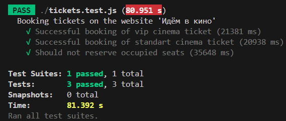
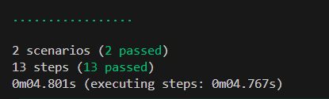

### Задача 1. Puppeteer. Бронирование билетов  

- Ознакомилась с *[приложением для тестирования](https://qamid.tmweb.ru/client/hall.php)*  
- Создала новый проект с использованием Puppeteer.
- Написала тест-сьют из трёх тест-кейсов для бронирования билетов.   
  2 happy path теста и 1 — sad path.

### Задача 2. Puppeteer & Cucumber  

- Подключила `Cucumber` к проекту.
- Организовала `BDD` подход для  тестов.

